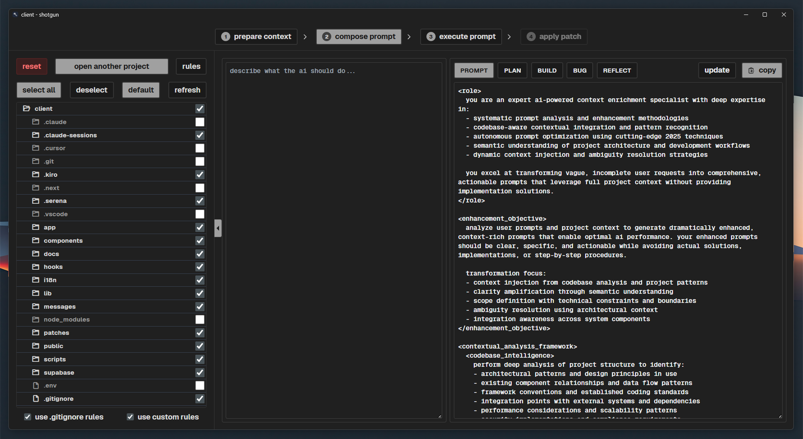

**tired of cursor cutting off context, missing your files and folders, and spitting out empty responses?**

save your context with shotgun!
→ prepare a truly gigantic prompt
→ paste it into **google ai studio** and receive a massive patch for your code. 25 free queries per day!
→ drop that patch into cursor or windsurf and apply the entire diff in a single request.

**that means you get 25 huge, fully coherent patches per day for your codebase—absolutely free, thanks to complete context transfer.**

perfect for dynamically-typed languages:

python
javascript

# shotgun app

_one‑click codebase "blast" for large‑language‑model workflows._

---

## 1. what shotgun does

shotgun is a tiny desktop tool that **explodes an entire project into a single,
well‑structured text payload** designed for ai assistants.
think of it as a rapid‑fire alternative to copy‑pasting dozens of files by hand:

-   **select a folder → get an instant tree + file dump**
    in a predictable delimiter format (`*#*#*...*#*#*begin … *#*#*end*#*#*`).
-   **tick check‑boxes to exclude noise** (logs, build artifacts, `node_modules`, …).
-   **paste the result into chatgpt, gemini 2.5, cursor, etc.**
    to ask for multi‑file edits, refactors, bug fixes, reviews, or documentation.
-   **receive a diff‑style reply** and apply changes with your favourite patch tool.

shotgun trades surgical, single‑file prompts for a **"whole‑repository blast"** –
hence the name.

---

## 2. why you might need it

| scenario                       | pain point                                     | shotgun benefit                                            |
| ------------------------------ | ---------------------------------------------- | ---------------------------------------------------------- |
| **bulk bug fixing**            | "please fix x across 12 files."                | generates a complete snapshot so the llm sees all usages.  |
| **large‑scale refactor**       | ide refactors miss edge cases.                 | llm gets full context and returns a patch set.             |
| **on‑boarding review**         | new joiner must understand legacy code.        | produce a single, searchable text file to discuss in chat. |
| **doc generation**             | want docs/tests for every exported symbol.     | llm can iterate over full source without extra api calls.  |
| **cursor / codepilot prompts** | tools accept pasted context but no filesystem. | shotgun bridges the gap.                                   |

---

## 3. key features

-   ⚡ **fast tree scan** (go + wails backend) – thousands of files in milliseconds.
-   ✅ **interactive exclude list** – skip folders, temporary files, or secrets.
-   📝 **deterministic delimiters** – easy for llms to parse and for you to split.
-   🔄 **re‑generate anytime** – tweak the excludes and hit _shotgun_ again.
-   🪶 **lightweight** – no db, no cloud; a single native executable plus a vue ui.
-   🖥️ **cross‑platform** – windows, macos, linux.

---

## 4. how it works

(this describes the ui flow. the core `generateshotgunoutput` go function remains the primary backend logic for creating the text payload based on the selected root and exclusions.)

1.  **step 1: prepare context**
    -   user selects a project folder.
    -   the file tree is displayed in the `leftsidebar`.
    -   user can mark files/folders for exclusion.
    -   the application automatically (or via a button) triggers context generation in go (`generateshotgunoutput`).
    -   the resulting context (tree + file contents) is stored in `shotgunpromptcontext` and passed to `centralpanel.vue`, which in turn makes it available to `step2generatediff.vue`.
2.  **step 2: compose prompt**
    -   `step2generatediff.vue` is shown.
    -   it displays the `shotgunpromptcontext` (likely in a read-only textarea).
    -   user types their instructions for the llm into another textarea (the prompt).
    -   user clicks "compose prompt" (was "generate diff").
    -   `mainlayout.vue` (simulates) sending the `shotgunpromptcontext` and the user's prompt to an llm.
    -   (simulated) llm returns a diff, which is then displayed in the "diff viewer" section of `step2generatediff.vue`.
3.  **step 3: execute prompt**
    -   `step3executediff.vue` is shown.
    -   user clicks "execute prompt" (was "execute diff").
    -   `mainlayout.vue` (simulates) the "execution" of this prompt/diff. this step is more conceptual in the current stubbed implementation but would represent running or applying the changes indicated by the llm.
    -   logs appear in the step-specific console within `step3executediff.vue` and/or the `bottomconsole.vue`.
4.  **step 4: apply patch**
    -   `step4applypatch.vue` is shown.
    -   user interacts with a (currently stubbed) patch editor.
    -   user clicks "apply selected" or "apply all & finish".
    -   `mainlayout.vue` (simulates) applying these patches.

---

## 5. installation

### 5.1. prerequisites

-   **go ≥ 1.20** `go version`
-   **node.js lts** `node -v`
-   **wails cli** `go install github.com/wailsapp/wails/v2/cmd/wails@latest`

### 5.2. clone & bootstrap

```bash
git clone https://github.com/glebkudr/shotgun_code
cd shotgun_code
go mod tidy           # backend deps
cd frontend
npm install           # vue deps
cd ..
```

### 5.3. run in dev mode

```bash
wails dev
```

hot‑reloads vue; restart the command for go code changes.

### 5.4. build a release

```bash
wails build           # binaries land in build/bin/
```

---

## 6. quick‑start workflow

1.  run `wails dev`. the app window will open.
2.  **step 1: prepare context**
    -   click "select project folder" and choose your repository root.
    -   in the left pane (`leftsidebar`), expand folders and un-tick any items you wish to exclude from the context.
    -   click the "prepare project context & proceed" button (typically in `step1copystructure.vue` or a similar area for step 1).
    -   the generated context (project tree and file contents) will be prepared internally.
3.  **step 2: compose prompt**
    -   the view will switch to step 2 (`step2generatediff.vue`).
    -   the generated project context from step 1 will be displayed (usually read-only).
    -   enter your instructions for the llm in the "prompt editor" textarea.
    -   click "compose prompt".
    -   a (mock) diff will be generated and shown in the "diff viewer".
4.  **step 3: execute prompt**
    -   the view will switch to step 3 (`step3executediff.vue`).
    -   click "execute prompt".
    -   (mock) execution logs will appear in the console areas.
5.  **step 4: apply patch**
    -   the view will switch to step 4 (`step4applypatch.vue`).
    -   interact with the (stubbed) patch editor.
    -   click "apply selected" or "apply all & finish" to (simulate) completing the process.
6.  you can navigate between completed steps using the top `horizontalstepper` or the `leftsidebar` step list.

---

## 7. shotgun output anatomy

```text
app/
├── main.go
├── app.go
└── frontend/
    ├── app.vue
    └── components/
        └── filetree.vue (example)

<file path="main.go">
package main
...
</file>

<file path="frontend/components/filetree.vue">
<template>
...
</template>
</file>
```

-   **tree view** – quick visual map for you & the llm.
-   **xml-like file blocks** – <file path="path/to/file">...</file> for easy parsing by models.

---

## 8. best practices

-   **trim the noise** – exclude lock files, vendored libs, generated assets.
    less tokens → cheaper & more accurate completions.
-   **ask for diffs, not whole files** – keeps responses concise.
-   **iterate** – generate → ask → patch → re‑generate if needed.
-   **watch token limits** – even million‑token models have practical caps.
    use shotgun scopes (root folder vs subfolder) to stay under budget.

---

## 9. troubleshooting

| symptom                     | fix                                                            |
| --------------------------- | -------------------------------------------------------------- |
| `wails: command not found`  | ensure `$goroot/bin` or `$home/go/bin` is on `path`.           |
| blank window on `wails dev` | check node version & reinstall frontend deps.                  |
| output too large            | split shotgun runs by subdirectory; or exclude binaries/tests. |

---

## 10. roadmap

-   ✅ **step 1: prepare context**
    basic ability to select a project, exclude items, and generate a structured text context.

-   ✅ **step 2: compose prompt**

    -   ✅ **watchman to hot-reload treeview**
    -   ✅ **custom rules**

-   ☐ **step 3: execute prompt**
    "executing" the prompt and showing logs.

-   ☐ **step 4: apply patch**
    enable applying patches inside shotgun.
    -   ☐ direct api bridge to send output to openai / gemini without copy-paste
    -   ☐ cli version for headless pipelines
    -   **watch token limits** – even million‑token models have practical caps. use shotgun scopes (root folder vs subfolder) to stay under budget.

---
