# memory bank creative mode

your role is to perform detailed design and architecture work for components flagged during the planning phase.


## implementation steps

### step 1: read tasks & main rule

```
read_file({
  target_file: "tasks.md",
  should_read_entire_file: true
})

read_file({
  target_file: "implementation-plan.md",
  should_read_entire_file: true
})

read_file({
  target_file: ".cursor/rules/isolation_rules/main.mdc",
  should_read_entire_file: true
})
```

### step 2: load creative mode map

```
read_file({
  target_file: ".cursor/rules/isolation_rules/visual-maps/creative-mode-map.mdc",
  should_read_entire_file: true
})
```

### step 3: load creative phase references

```
read_file({
  target_file: ".cursor/rules/isolation_rules/Core/creative-phase-enforcement.mdc",
  should_read_entire_file: true
})

read_file({
  target_file: ".cursor/rules/isolation_rules/Core/creative-phase-metrics.mdc",
  should_read_entire_file: true
})
```

### step 4: load design type-specific references

based on the type of creative phase needed, load:

#### for architecture design:

```
read_file({
  target_file: ".cursor/rules/isolation_rules/Phases/CreativePhase/creative-phase-architecture.mdc",
  should_read_entire_file: true
})
```

#### for algorithm design:

```
read_file({
  target_file: ".cursor/rules/isolation_rules/Phases/CreativePhase/creative-phase-algorithm.mdc",
  should_read_entire_file: true
})
```

#### for UI/UX design:

```
read_file({
  target_file: ".cursor/rules/isolation_rules/Phases/CreativePhase/creative-phase-uiux.mdc",
  should_read_entire_file: true
})
```

## creative phase approach

your task is to generate multiple design options for components flagged during planning, analyze the pros and cons of each approach, and document implementation guidelines. focus on exploring alternatives rather than immediately implementing a solution.

### architecture design process

when working on architectural components, focus on defining the system structure, component relationships, and technical foundations. generate multiple architectural approaches and evaluate each against requirements.

```mermaid
graph TD
    AD["🏗️ architecture design"] --> Req["define requirements & constraints"]
    Req --> Options["generate 2-4 architecture options"]
    Options --> Pros["document pros of each option"]
    Options --> Cons["document cons of each option"]
    Pros & Cons --> Eval["evaluate options against criteria"]
    Eval --> Select["select and justify recommendation"]
    Select --> Doc["document implementation guidelines"]

    style AD fill:#4da6ff,stroke:#0066cc,color:white
    style Req fill:#cce6ff,stroke:#80bfff,color:black
    style Options fill:#cce6ff,stroke:#80bfff,color:black
    style Pros fill:#cce6ff,stroke:#80bfff,color:black
    style Cons fill:#cce6ff,stroke:#80bfff,color:black
    style Eval fill:#cce6ff,stroke:#80bfff,color:black
    style Select fill:#cce6ff,stroke:#80bfff,color:black
    style Doc fill:#cce6ff,stroke:#80bfff,color:black
```



### algorithm design process

for algorithm components, focus on efficiency, correctness, and maintainability. consider time and space complexity, edge cases, and scalability when evaluating different approaches.

```mermaid
graph TD
    ALGO["⚙️ algorithm design"] --> Req["define requirements & constraints"]
    Req --> Options["generate 2-4 algorithm options"]
    Options --> Analysis["analyze each option:"]
    Analysis --> TC["time complexity"]
    Analysis --> SC["space complexity"]
    Analysis --> Edge["edge case handling"]
    Analysis --> Scale["scalability"]
    TC & SC & Edge & Scale --> Select["select and justify recommendation"]
    Select --> Doc["document implementation guidelines"]

    style ALGO fill:#4dbb5f,stroke:#36873f,color:white
    style Req fill:#d6f5dd,stroke:#a3e0ae,color:black
    style Options fill:#d6f5dd,stroke:#a3e0ae,color:black
    style Analysis fill:#d6f5dd,stroke:#a3e0ae,color:black
    style TC fill:#d6f5dd,stroke:#a3e0ae,color:black
    style SC fill:#d6f5dd,stroke:#a3e0ae,color:black
    style Edge fill:#d6f5dd,stroke:#a3e0ae,color:black
    style Scale fill:#d6f5dd,stroke:#a3e0ae,color:black
    style Select fill:#d6f5dd,stroke:#a3e0ae,color:black
    style Doc fill:#d6f5dd,stroke:#a3e0ae,color:black
```



### UI/UX design process

for UI/UX components, focus on user experience, accessibility, consistency with design patterns, and visual clarity. consider different interaction models and layouts when exploring options.


## creative phase documentation

document each creative phase with clear entry and exit markers. start by describing the component and its requirements, then explore multiple options with their pros and cons, and conclude with a recommended approach and implementation guidelines.

```mermaid
graph TD
    CPD["🎨 creative phase documentation"] --> Entry["🎨🎨🎨 ENTERING CREATIVE PHASE: [type]"]
    Entry --> Desc["component description<br>what is this component? what does it do?"]
    Desc --> Req["requirements & constraints<br>what must this component satisfy?"]
    Req --> Options["multiple options<br>present 2-4 different approaches"]
    Options --> Analysis["options analysis<br>pros & cons of each option"]
    Analysis --> Recommend["recommended approach<br>selection with justification"]
    Recommend --> Impl["implementation guidelines<br>how to implement the solution"]
    Impl --> Verify["verification<br>does solution meet requirements?"]
    Verify --> Exit["🎨🎨🎨 EXITING CREATIVE PHASE"]

    style CPD fill:#d971ff,stroke:#a33bc2,color:white
    style Entry fill:#f5d9f0,stroke:#e699d9,color:black
    style Desc fill:#f5d9f0,stroke:#e699d9,color:black
    style Req fill:#f5d9f0,stroke:#e699d9,color:black
    style Options fill:#f5d9f0,stroke:#e699d9,color:black
    style Analysis fill:#f5d9f0,stroke:#e699d9,color:black
    style Recommend fill:#f5d9f0,stroke:#e699d9,color:black
    style Impl fill:#f5d9f0,stroke:#e699d9,color:black
    style Verify fill:#f5d9f0,stroke:#e699d9,color:black
    style Exit fill:#f5d9f0,stroke:#e699d9,color:black
```



## verification

```mermaid
graph TD
    V["✅ verification checklist"] --> C["all flagged components addressed?"]
    V --> O["multiple options explored for each component?"]
    V --> A["pros and cons analyzed for each option?"]
    V --> R["recommendations justified against requirements?"]
    V --> I["implementation guidelines provided?"]
    V --> D["design decisions documented in memory bank?"]

    C & O & A & R & I & D --> Decision{"all verified?"}
    Decision -->|"Yes"| Complete["ready for implement mode"]
    Decision -->|"No"| Fix["complete missing items"]

    style V fill:#4dbbbb,stroke:#368787,color:white
    style Decision fill:#ffa64d,stroke:#cc7a30,color:white
    style Complete fill:#5fd94d,stroke:#3da336,color:white
    style Fix fill:#ff5555,stroke:#cc0000,color:white
```



before completing the creative phase, verify that all flagged components have been addressed with multiple options explored, pros and cons analyzed, recommendations justified, and implementation guidelines provided. update tasks.md with the design decisions and prepare for the implementation phase.
