# memory bank build mode

your role is to build the planned changes following the implementation plan and creative phase decisions.

```mermaid
graph TD
    Start["🚀 start build mode"] --> ReadDocs["📚 read reference documents<br>.cursor/rules/isolation_rules/Core/command-execution.mdc"]

    %% initialization
    ReadDocs --> CheckLevel{"🧩 determine<br>complexity level<br>from tasks.md"}

    %% level 1 implementation
    CheckLevel -->|"level 1<br>quick bug fix"| L1Process["🔧 level 1 process<br>.cursor/rules/isolation_rules/visual-maps/implement-mode-map.mdc"]
    L1Process --> L1Review["🔍 review bug<br>report"]
    L1Review --> L1Examine["👁️ examine<br>relevant code"]
    L1Examine --> L1Fix["⚒️ implement<br>targeted fix"]
    L1Fix --> L1Test["✅ test<br>fix"]
    L1Test --> L1Update["📝 update<br>tasks.md"]

    %% level 2 implementation
    CheckLevel -->|"level 2<br>simple enhancement"| L2Process["🔨 level 2 process<br>.cursor/rules/isolation_rules/visual-maps/implement-mode-map.mdc"]
    L2Process --> L2Review["🔍 review build<br>plan"]
    L2Review --> L2Examine["👁️ examine relevant<br>code areas"]
    L2Examine --> L2Implement["⚒️ implement changes<br>sequentially"]
    L2Implement --> L2Test["✅ test<br>changes"]
    L2Test --> L2Update["📝 update<br>tasks.md"]

    %% level 3-4 implementation
    CheckLevel -->|"level 3-4<br>feature/system"| L34Process["🏗️ level 3-4 process<br>.cursor/rules/isolation_rules/visual-maps/implement-mode-map.mdc"]
    L34Process --> L34Review["🔍 review plan &<br>creative decisions"]
    L34Review --> L34Phase{"📋 select<br>build<br>phase"}

    %% implementation phases
    L34Phase --> L34Phase1["⚒️ phase 1<br>build"]
    L34Phase1 --> L34Test1["✅ test<br>phase 1"]
    L34Test1 --> L34Document1["📝 document<br>phase 1"]
    L34Document1 --> L34Next1{"📋 next<br>phase?"}
    L34Next1 -->|"yes"| L34Phase

    L34Next1 -->|"no"| L34Integration["🔄 integration<br>testing"]
    L34Integration --> L34Document["📝 document<br>integration points"]
    L34Document --> L34Update["📝 update<br>tasks.md"]

    %% command execution
    L1Fix & L2Implement & L34Phase1 --> CommandExec["⚙️ command execution<br>.cursor/rules/isolation_rules/Core/command-execution.mdc"]
    CommandExec --> DocCommands["📝 document commands<br>& results"]

    %% implementation documentation
    DocCommands -.-> DocTemplate["📋 build doc:<br>- code changes<br>- commands executed<br>- results/observations<br>- status"]

    %% completion & transition
    L1Update & L2Update & L34Update --> VerifyComplete["✅ verify build<br>complete"]
    VerifyComplete --> UpdateTasks["📝 final update to<br>tasks.md"]
    UpdateTasks --> Transition["⏭️ next mode:<br>reflect mode"]

    %% validation options
    Start -.-> Validation["🔍 validation options:<br>- review build plans<br>- show code build<br>- document command execution<br>- test builds<br>- show mode transition"]

    %% styling
    style Start fill:#4da6ff,stroke:#0066cc,color:white
    style ReadDocs fill:#80bfff,stroke:#4da6ff,color:black
    style CheckLevel fill:#d94dbb,stroke:#a3378a,color:white
    style L1Process fill:#4dbb5f,stroke:#36873f,color:white
    style L2Process fill:#ffa64d,stroke:#cc7a30,color:white
    style L34Process fill:#ff5555,stroke:#cc0000,color:white
    style CommandExec fill:#d971ff,stroke:#a33bc2,color:white
    style VerifyComplete fill:#4dbbbb,stroke:#368787,color:white
    style Transition fill:#5fd94d,stroke:#3da336,color:white
```



## build steps

### step 1: read command execution rules

```
read_file({
  target_file: ".cursor/rules/isolation_rules/Core/command-execution.mdc",
  should_read_entire_file: true
})
```

### step 2: read tasks & implementation plan

```
read_file({
  target_file: "tasks.md",
  should_read_entire_file: true
})

read_file({
  target_file: "implementation-plan.md",
  should_read_entire_file: true
})
```

### step 3: load implementation mode map

```
read_file({
  target_file: ".cursor/rules/isolation_rules/visual-maps/implement-mode-map.mdc",
  should_read_entire_file: true
})
```

### step 4: load complexity-specific implementation references

based on complexity level determined from tasks.md, load:

#### for level 1:

```
read_file({
  target_file: ".cursor/rules/isolation_rules/Level1/workflow-level1.mdc",
  should_read_entire_file: true
})
```

#### for level 2:

```
read_file({
  target_file: ".cursor/rules/isolation_rules/Level2/workflow-level2.mdc",
  should_read_entire_file: true
})
```

#### for level 3-4:

```
read_file({
  target_file: ".cursor/rules/isolation_rules/Phases/Implementation/implementation-phase-reference.mdc",
  should_read_entire_file: true
})

read_file({
  target_file: ".cursor/rules/isolation_rules/Level4/phased-implementation.mdc",
  should_read_entire_file: true
})
```

## build approach

your task is to build the changes defined in the implementation plan, following the decisions made during the creative phases if applicable. execute changes systematically, document results, and verify that all requirements are met.

### level 1: quick bug fix build

for level 1 tasks, focus on implementing targeted fixes for specific issues. understand the bug, examine the relevant code, implement a precise fix, and verify that the issue is resolved.

```mermaid
graph TD
    L1["🔧 level 1 build"] --> Review["review the issue carefully"]
    Review --> Locate["locate specific code causing the issue"]
    Locate --> Fix["implement focused fix"]
    Fix --> Test["test thoroughly to verify resolution"]
    Test --> Doc["document the solution"]

    style L1 fill:#4dbb5f,stroke:#36873f,color:white
    style Review fill:#d6f5dd,stroke:#a3e0ae,color:black
    style Locate fill:#d6f5dd,stroke:#a3e0ae,color:black
    style Fix fill:#d6f5dd,stroke:#a3e0ae,color:black
    style Test fill:#d6f5dd,stroke:#a3e0ae,color:black
    style Doc fill:#d6f5dd,stroke:#a3e0ae,color:black
```



### level 2: enhancement build

for level 2 tasks, implement changes according to the plan created during the planning phase. ensure each step is completed and tested before moving to the next, maintaining clarity and focus throughout the process.

```mermaid
graph TD
    L2["🔨 level 2 build"] --> Plan["follow build plan"]
    Plan --> Components["build each component"]
    Components --> Test["test each component"]
    Test --> Integration["verify integration"]
    Integration --> Doc["document build details"]

    style L2 fill:#ffa64d,stroke:#cc7a30,color:white
    style Plan fill:#ffe6cc,stroke:#ffa64d,color:black
    style Components fill:#ffe6cc,stroke:#ffa64d,color:black
    style Test fill:#ffe6cc,stroke:#ffa64d,color:black
    style Integration fill:#ffe6cc,stroke:#ffa64d,color:black
    style Doc fill:#ffe6cc,stroke:#ffa64d,color:black
```



### level 3-4: phased build

for level 3-4 tasks, implement using a phased approach as defined in the implementation plan. each phase should be built, tested, and documented before proceeding to the next, with careful attention to integration between components.

```mermaid
graph TD
    L34["🏗️ level 3-4 build"] --> CreativeReview["review creative phase decisions"]
    CreativeReview --> Phases["build in planned phases"]
    Phases --> Phase1["phase 1: core components"]
    Phases --> Phase2["phase 2: secondary components"]
    Phases --> Phase3["phase 3: integration & polish"]
    Phase1 & Phase2 & Phase3 --> Test["comprehensive testing"]
    Test --> Doc["detailed documentation"]

    style L34 fill:#ff5555,stroke:#cc0000,color:white
    style CreativeReview fill:#ffaaaa,stroke:#ff8080,color:black
    style Phases fill:#ffaaaa,stroke:#ff8080,color:black
    style Phase1 fill:#ffaaaa,stroke:#ff8080,color:black
    style Phase2 fill:#ffaaaa,stroke:#ff8080,color:black
    style Phase3 fill:#ffaaaa,stroke:#ff8080,color:black
    style Test fill:#ffaaaa,stroke:#ff8080,color:black
    style Doc fill:#ffaaaa,stroke:#ff8080,color:black
```



## command execution principles

when building changes, follow these command execution principles for optimal results:


focus on effective building while adapting your approach to the platform environment. trust your capabilities to execute appropriate commands for the current system without excessive prescriptive guidance.

## verification

```mermaid
graph TD
    V["✅ verification checklist"] --> I["all build steps completed?"]
    V --> T["changes thoroughly tested?"]
    V --> R["build meets requirements?"]
    V --> D["build details documented?"]
    V --> U["tasks.md updated with status?"]

    I & T & R & D & U --> Decision{"all verified?"}
    Decision -->|"yes"| Complete["ready for reflect mode"]
    Decision -->|"no"| Fix["complete missing items"]

    style V fill:#4dbbbb,stroke:#368787,color:white
    style Decision fill:#ffa64d,stroke:#cc7a30,color:white
    style Complete fill:#5fd94d,stroke:#3da336,color:white
    style Fix fill:#ff5555,stroke:#cc0000,color:white
```



before completing the build phase, verify that all build steps have been completed, changes have been thoroughly tested, the build meets all requirements, details have been documented, and tasks.md has been updated with the current status. once verified, prepare for the reflection phase.
