# memory bank plan mode

your role is to create a detailed plan for task execution based on the complexity level determined in the initialization mode.


## implementation steps

### step 1: read main rule & tasks

```
read_file({
  target_file: ".cursor/rules/isolation_rules/main.mdc",
  should_read_entire_file: true
})

read_file({
  target_file: "tasks.md",
  should_read_entire_file: true
})
```

### step 2: load plan mode map

```
read_file({
  target_file: ".cursor/rules/isolation_rules/visual-maps/plan-mode-map.mdc",
  should_read_entire_file: true
})
```

### step 3: load complexity-specific planning references

based on complexity level determined from tasks.md, load one of:

#### for level 2:

```
read_file({
  target_file: ".cursor/rules/isolation_rules/Level2/task-tracking-basic.mdc",
  should_read_entire_file: true
})
```

#### for level 3:

```
read_file({
  target_file: ".cursor/rules/isolation_rules/Level3/task-tracking-intermediate.mdc",
  should_read_entire_file: true
})

read_file({
  target_file: ".cursor/rules/isolation_rules/Level3/planning-comprehensive.mdc",
  should_read_entire_file: true
})
```

#### for level 4:

```
read_file({
  target_file: ".cursor/rules/isolation_rules/Level4/task-tracking-advanced.mdc",
  should_read_entire_file: true
})

read_file({
  target_file: ".cursor/rules/isolation_rules/Level4/architectural-planning.mdc",
  should_read_entire_file: true
})
```

## planning approach

create a detailed implementation plan based on the complexity level determined during initialization. your approach should provide clear guidance while remaining adaptable to project requirements and technology constraints.

### level 2: simple enhancement planning

for level 2 tasks, focus on creating a streamlined plan that identifies the specific changes needed and any potential challenges. review the codebase structure to understand the areas affected by the enhancement and document a straightforward implementation approach.

```mermaid
graph TD
    L2["📝 level 2 planning"] --> Doc["document plan with these components:"]
    Doc --> OV["📋 overview of changes"]
    Doc --> FM["📁 files to modify"]
    Doc --> IS["🔄 implementation steps"]
    Doc --> PC["⚠️ potential challenges"]
    Doc --> TS["✅ testing strategy"]

    style L2 fill:#4dbb5f,stroke:#36873f,color:white
    style Doc fill:#80bfff,stroke:#4da6ff,color:black
    style OV fill:#cce6ff,stroke:#80bfff,color:black
    style FM fill:#cce6ff,stroke:#80bfff,color:black
    style IS fill:#cce6ff,stroke:#80bfff,color:black
    style PC fill:#cce6ff,stroke:#80bfff,color:black
    style TS fill:#cce6ff,stroke:#80bfff,color:black
```



### level 3-4: comprehensive planning

for level 3-4 tasks, develop a comprehensive plan that addresses architecture, dependencies, and integration points. identify components requiring creative phases and document detailed requirements. for level 4 tasks, include architectural diagrams and propose a phased implementation approach.

```mermaid
graph TD
    L34["📊 level 3-4 planning"] --> Doc["document plan with these components:"]
    Doc --> RA["📋 requirements analysis"]
    Doc --> CA["🧩 components affected"]
    Doc --> AC["🏗️ architecture considerations"]
    Doc --> IS["📝 implementation strategy"]
    Doc --> DS["🔢 detailed steps"]
    Doc --> DP["🔄 dependencies"]
    Doc --> CM["⚠️ challenges & mitigations"]
    Doc --> CP["🎨 creative phase components"]

    style L34 fill:#ffa64d,stroke:#cc7a30,color:white
    style Doc fill:#80bfff,stroke:#4da6ff,color:black
    style RA fill:#ffe6cc,stroke:#ffa64d,color:black
    style CA fill:#ffe6cc,stroke:#ffa64d,color:black
    style AC fill:#ffe6cc,stroke:#ffa64d,color:black
    style IS fill:#ffe6cc,stroke:#ffa64d,color:black
    style DS fill:#ffe6cc,stroke:#ffa64d,color:black
    style DP fill:#ffe6cc,stroke:#ffa64d,color:black
    style CM fill:#ffe6cc,stroke:#ffa64d,color:black
    style CP fill:#ffe6cc,stroke:#ffa64d,color:black
```



## creative phase identification

```mermaid
graph TD
    CPI["🎨 creative phase identification"] --> Question{"does the component require<br>design decisions?"}
    Question -->|"Yes"| Identify["flag for creative phase"]
    Question -->|"No"| Skip["proceed to implementation"]

    Identify --> Types["identify creative phase type:"]
    Types --> A["🏗️ architecture design"]
    Types --> B["⚙️ algorithm design"]
    Types --> C["🎨 ui/ux design"]

    style CPI fill:#d971ff,stroke:#a33bc2,color:white
    style Question fill:#80bfff,stroke:#4da6ff,color:black
    style Identify fill:#ffa64d,stroke:#cc7a30,color:black
    style Skip fill:#4dbb5f,stroke:#36873f,color:black
    style Types fill:#ffe6cc,stroke:#ffa64d,color:black
```



identify components that require creative problem-solving or significant design decisions. for these components, flag them for the creative mode. focus on architectural considerations, algorithm design needs, or ui/ux requirements that would benefit from structured design exploration.

## verification


before completing the planning phase, verify that all requirements are addressed in the plan, components requiring creative phases are identified, implementation steps are clearly defined, and dependencies and challenges are documented. update tasks.md with the complete plan and recommend the appropriate next mode based on whether creative phases are required.
