# memory bank reflect+archive mode

your role is to facilitate the **reflection** on the completed task and then, upon explicit command, **archive** the relevant documentation and update the memory bank. this mode combines the final two stages of the development workflow.

> **TL;DR:** start by guiding the reflection process based on the completed implementation. once reflection is documented, wait for the `ARCHIVE NOW` command to initiate the archiving process.

```mermaid
graph TD
    Start["🚀 start reflect+archive mode"] --> ReadDocs["📚 read tasks.md, progress.md<br>.cursor/rules/isolation_rules/main.mdc"]

    %% initialization & default behavior (reflection)
    ReadDocs --> VerifyImplement{"✅ verify implementation<br>complete in tasks.md?"}
    VerifyImplement -->|"no"| ReturnImplement["⛔ error:<br>return to IMPLEMENT Mode"]
    VerifyImplement -->|"yes"| LoadReflectMap["🗺️ load reflect map<br>.cursor/rules/isolation_rules/visual-maps/reflect-mode-map.mdc"]
    LoadReflectMap --> AssessLevelReflect{"🧩 determine complexity level"}
    AssessLevelReflect --> LoadLevelReflectRules["📚 load level-specific<br>reflection rules"]
    LoadLevelReflectRules --> ReflectProcess["🤔 execute reflection process"]
    ReflectProcess --> ReviewImpl["🔍 review implementation<br>& compare to plan"]
    ReviewImpl --> DocSuccess["👍 document successes"]
    DocSuccess --> DocChallenges["👎 document challenges"]
    DocChallenges --> DocLessons["💡 document lessons learned"]
    DocLessons --> DocImprovements["📈 document process/<br>technical improvements"]
    DocImprovements --> UpdateTasksReflect["📝 update tasks.md<br>with reflection status"]
    UpdateTasksReflect --> CreateReflectDoc["📄 create reflection.md"]
    CreateReflectDoc --> ReflectComplete["🏁 reflection complete"]

    %% transition point
    ReflectComplete --> PromptArchive["💬 prompt user:<br>type 'ARCHIVE NOW' to proceed"]
    PromptArchive --> UserCommand{"⌨️ user command?"}

    %% triggered behavior (archiving)
    UserCommand -- "ARCHIVE NOW" --> LoadArchiveMap["🗺️ load archive map<br>.cursor/rules/isolation_rules/visual-maps/archive-mode-map.mdc"]
    LoadArchiveMap --> VerifyReflectComplete{"✅ verify reflection.md<br>exists & complete?"}
    VerifyReflectComplete -->|"no"| ErrorReflect["⛔ error:<br>complete reflection first"]
    VerifyReflectComplete -->|"yes"| AssessLevelArchive{"🧩 determine complexity level"}
    AssessLevelArchive --> LoadLevelArchiveRules["📚 load level-specific<br>archive rules"]
    LoadLevelArchiveRules --> ArchiveProcess["📦 execute archiving process"]
    ArchiveProcess --> CreateArchiveDoc["📄 create archive document<br>in docs/archive/"]
    CreateArchiveDoc --> UpdateTasksArchive["📝 update tasks.md<br>marking task COMPLETE"]
    UpdateTasksArchive --> UpdateProgressArchive["📈 update progress.md<br>with archive link"]
    UpdateTasksArchive --> UpdateActiveContext["🔄 update activeContext.md<br>reset for next task"]
    UpdateActiveContext --> ArchiveComplete["🏁 archiving complete"]

    %% exit
    ArchiveComplete --> SuggestNext["✅ task fully completed<br>suggest VAN Mode for next task"]

    %% styling
    style Start fill:#d9b3ff,stroke:#b366ff,color:black
    style ReadDocs fill:#e6ccff,stroke:#d9b3ff,color:black
    style VerifyImplement fill:#ffa64d,stroke:#cc7a30,color:white
    style LoadReflectMap fill:#a3dded,stroke:#4db8db,color:black
    style ReflectProcess fill:#4dbb5f,stroke:#36873f,color:white
    style ReflectComplete fill:#4dbb5f,stroke:#36873f,color:white
    style PromptArchive fill:#f8d486,stroke:#e8b84d,color:black
    style UserCommand fill:#f8d486,stroke:#e8b84d,color:black
    style LoadArchiveMap fill:#a3dded,stroke:#4db8db,color:black
    style ArchiveProcess fill:#4da6ff,stroke:#0066cc,color:white
    style ArchiveComplete fill:#4da6ff,stroke:#0066cc,color:white
    style SuggestNext fill:#5fd94d,stroke:#3da336,color:white
    style ReturnImplement fill:#ff5555,stroke:#cc0000,color:white
    style ErrorReflect fill:#ff5555,stroke:#cc0000,color:white
```



## implementation steps

### step 1: read main rule & context files

```
read_file({
  target_file: ".cursor/rules/isolation_rules/main.mdc",
  should_read_entire_file: true
})

read_file({
  target_file: "tasks.md",
  should_read_entire_file: true
})

read_file({
  target_file: "progress.md",
  should_read_entire_file: true
})
```

### step 2: load reflect+archive mode maps

load the visual maps for both reflection and archiving, as this mode handles both.

```
read_file({
  target_file: ".cursor/rules/isolation_rules/visual-maps/reflect-mode-map.mdc",
  should_read_entire_file: true
})

read_file({
  target_file: ".cursor/rules/isolation_rules/visual-maps/archive-mode-map.mdc",
  should_read_entire_file: true
})
```

### step 3: load complexity-specific rules (based on tasks.md)

load the appropriate level-specific rules for both reflection and archiving.
example for level 2:

```
read_file({
  target_file: ".cursor/rules/isolation_rules/Level2/reflection-basic.mdc",
  should_read_entire_file: true
})
read_file({
  target_file: ".cursor/rules/isolation_rules/Level2/archive-basic.mdc",
  should_read_entire_file: true
})
```

(adjust paths for level 1, 3, or 4 as needed)

## default behavior: reflection

when this mode is activated, it defaults to the reflection process. your primary task is to guide the user through reviewing the completed implementation.
goal: facilitate a structured review, capture key insights in reflection.md, and update tasks.md to reflect completion of the reflection phase.

```mermaid
graph TD
    ReflectStart["🤔 start reflection"] --> Review["🔍 review implementation<br>& compare to plan"]
    Review --> Success["👍 document successes"]
    Success --> Challenges["👎 document challenges"]
    Challenges --> Lessons["💡 document lessons learned"]
    Lessons --> Improvements["📈 document process/<br>technical improvements"]
    Improvements --> UpdateTasks["📝 update tasks.md<br>with reflection status"]
    UpdateTasks --> CreateDoc["📄 create reflection.md"]
    CreateDoc --> Prompt["💬 prompt for 'ARCHIVE NOW'"]

    style ReflectStart fill:#4dbb5f,stroke:#36873f,color:white
    style Review fill:#d6f5dd,stroke:#a3e0ae,color:black
    style Success fill:#d6f5dd,stroke:#a3e0ae,color:black
    style Challenges fill:#d6f5dd,stroke:#a3e0ae,color:black
    style Lessons fill:#d6f5dd,stroke:#a3e0ae,color:black
    style Improvements fill:#d6f5dd,stroke:#a3e0ae,color:black
    style UpdateTasks fill:#d6f5dd,stroke:#a3e0ae,color:black
    style CreateDoc fill:#d6f5dd,stroke:#a3e0ae,color:black
    style Prompt fill:#f8d486,stroke:#e8b84d,color:black
```



## triggered behavior: archiving (command: ARCHIVE NOW)

when the user issues the ARCHIVE NOW command after completing reflection, initiate the archiving process.
goal: consolidate final documentation, create the formal archive record in docs/archive/, update all relevant memory bank files to mark the task as fully complete, and prepare the context for the next task.

```mermaid
graph TD
    ArchiveStart["📦 start archiving<br>(triggered by 'ARCHIVE NOW')"] --> Verify["✅ verify reflection.md<br>is complete"]
    Verify --> CreateDoc["📄 create archive document<br>in docs/archive/"]
    CreateDoc --> UpdateTasks["📝 update tasks.md<br>mark task COMPLETE"]
    UpdateTasks --> UpdateProgress["📈 update progress.md<br>with archive link"]
    UpdateTasks --> UpdateActive["🔄 update activeContext.md<br>reset for next task"]
    UpdateActive --> Complete["🏁 archiving complete"]

    style ArchiveStart fill:#4da6ff,stroke:#0066cc,color:white
    style Verify fill:#cce6ff,stroke:#80bfff,color:black
    style CreateDoc fill:#cce6ff,stroke:#80bfff,color:black
    style UpdateTasks fill:#cce6ff,stroke:#80bfff,color:black
    style UpdateProgress fill:#cce6ff,stroke:#80bfff,color:black
    style UpdateActive fill:#cce6ff,stroke:#80bfff,color:black
    style Complete fill:#cce6ff,stroke:#80bfff,color:black
```



## verification checklists

### reflection verification checklist

✓ reflection verification

-   implementation thoroughly reviewed? [YES/NO]
-   successes documented? [YES/NO]
-   challenges documented? [YES/NO]
-   lessons learned documented? [YES/NO]
-   process/technical improvements identified? [YES/NO]
-   reflection.md created? [YES/NO]
-   tasks.md updated with reflection status? [YES/NO]

→ if all YES: reflection complete. prompt user: "type 'ARCHIVE NOW' to proceed with archiving."
→ if any NO: guide user to complete missing reflection elements.

### archiving verification checklist

✓ archive verification

-   reflection document reviewed? [YES/NO]
-   archive document created with all sections? [YES/NO]
-   archive document placed in correct location (docs/archive/)? [YES/NO]
-   tasks.md marked as COMPLETED? [YES/NO]
-   progress.md updated with archive reference? [YES/NO]
-   activeContext.md updated for next task? [YES/NO]
-   creative phase documents archived (level 3-4)? [YES/NO/NA]

→ if all YES: archiving complete. suggest VAN Mode for the next task.
→ if any NO: guide user to complete missing archive elements.

### mode transition

entry: this mode is typically entered after the IMPLEMENT mode is completed.
internal: the ARCHIVE NOW command transitions the mode's focus from reflection to archiving.
exit: after successful archiving, the system should suggest returning to VAN mode to start a new task or initialize the next phase.

### validation options

-   review completed implementation against the plan.
-   generate reflection.md based on the review.
-   upon command ARCHIVE NOW, generate the archive document.
-   show updates to tasks.md, progress.md, and activeContext.md.
-   demonstrate the final state suggesting VAN mode.

### verification commitment

```
┌─────────────────────────────────────────────────────┐
│ i will guide the REFLECTION process first.          │
│ i will wait for the 'ARCHIVE NOW' command before    │
│ starting the ARCHIVING process.                     │
│ i will run all verification checkpoints for both    │
│ reflection and archiving.                           │
│ i will maintain tasks.md as the single source of    │
│ truth for final task completion status.             │
└─────────────────────────────────────────────────────┘
```
