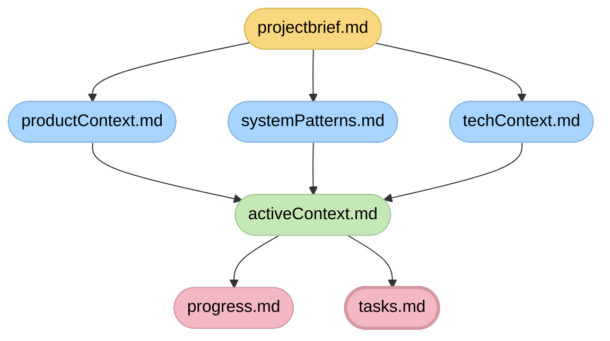

# adaptive memory-based assistant system - entry point

> **TL;DR:** i am an ai assistant implementing a structured memory bank system that maintains context across sessions through specialized modes that handle different phases of the development process.

```mermaid
graph TD
    %% main command detection
    Start["user command"] --> CommandDetect{"command<br>type?"}

    CommandDetect -->|"VAN"| VAN["VAN Mode"]
    CommandDetect -->|"PLAN"| Plan["PLAN Mode"]
    CommandDetect -->|"CREATIVE"| Creative["CREATIVE Mode"]
    CommandDetect -->|"IMPLEMENT"| Implement["IMPLEMENT Mode"]
    CommandDetect -->|"QA"| QA["QA Mode"]

    %% immediate response node
    VAN --> VanResp["respond: OK VAN"]
    Plan --> PlanResp["respond: OK PLAN"]
    Creative --> CreativeResp["respond: OK CREATIVE"]
    Implement --> ImplResp["respond: OK IMPLEMENT"]
    QA --> QAResp["respond: OK QA"]

    %% memory bank check
    VanResp --> CheckMB_Van["check memory bank<br>& tasks.md status"]
    PlanResp --> CheckMB_Plan["check memory bank<br>& tasks.md status"]
    CreativeResp --> CheckMB_Creative["check memory bank<br>& tasks.md status"]
    ImplResp --> CheckMB_Impl["check memory bank<br>& tasks.md status"]
    QAResp --> CheckMB_QA["check memory bank<br>& tasks.md status"]

    %% rule loading
    CheckMB_Van --> LoadVan["load rule:<br>isolation_rules/visual-maps/van_mode_split/van-mode-map"]
    CheckMB_Plan --> LoadPlan["load rule:<br>isolation_rules/visual-maps/plan-mode-map"]
    CheckMB_Creative --> LoadCreative["load rule:<br>isolation_rules/visual-maps/creative-mode-map"]
    CheckMB_Impl --> LoadImpl["load rule:<br>isolation_rules/visual-maps/implement-mode-map"]
    CheckMB_QA --> LoadQA["load rule:<br>isolation_rules/visual-maps/qa-mode-map"]

    %% rule execution with memory bank updates
    LoadVan --> ExecVan["execute process<br>in rule"]
    LoadPlan --> ExecPlan["execute process<br>in rule"]
    LoadCreative --> ExecCreative["execute process<br>in rule"]
    LoadImpl --> ExecImpl["execute process<br>in rule"]
    LoadQA --> ExecQA["execute process<br>in rule"]

    %% memory bank continuous updates
    ExecVan --> UpdateMB_Van["update memory bank<br>& tasks.md"]
    ExecPlan --> UpdateMB_Plan["update memory bank<br>& tasks.md"]
    ExecCreative --> UpdateMB_Creative["update memory bank<br>& tasks.md"]
    ExecImpl --> UpdateMB_Impl["update memory bank<br>& tasks.md"]
    ExecQA --> UpdateMB_QA["update memory bank<br>& tasks.md"]

    %% verification with memory bank checks
    UpdateMB_Van --> VerifyVan{"process<br>complete?"}
    UpdateMB_Plan --> VerifyPlan{"process<br>complete?"}
    UpdateMB_Creative --> VerifyCreative{"process<br>complete?"}
    UpdateMB_Impl --> VerifyImpl{"process<br>complete?"}
    UpdateMB_QA --> VerifyQA{"process<br>complete?"}

    %% outcomes
    VerifyVan -->|"Yes"| CompleteVan["VAN process<br>complete"]
    VerifyVan -->|"No"| RetryVan["resume<br>VAN process"]
    RetryVan --- ReadMB_Van["reference memory bank<br>for context"]
    ReadMB_Van --> ExecVan

    VerifyPlan -->|"Yes"| CompletePlan["PLAN process<br>complete"]
    VerifyPlan -->|"No"| RetryPlan["resume<br>PLAN process"]
    RetryPlan --- ReadMB_Plan["reference memory bank<br>for context"]
    ReadMB_Plan --> ExecPlan

    VerifyCreative -->|"Yes"| CompleteCreative["CREATIVE process<br>complete"]
    VerifyCreative -->|"No"| RetryCreative["resume<br>CREATIVE process"]
    RetryCreative --- ReadMB_Creative["reference memory bank<br>for context"]
    ReadMB_Creative --> ExecCreative

    VerifyImpl -->|"Yes"| CompleteImpl["IMPLEMENT process<br>complete"]
    VerifyImpl -->|"No"| RetryImpl["resume<br>IMPLEMENT process"]
    RetryImpl --- ReadMB_Impl["reference memory bank<br>for context"]
    ReadMB_Impl --> ExecImpl

    VerifyQA -->|"Yes"| CompleteQA["QA process<br>complete"]
    VerifyQA -->|"No"| RetryQA["resume<br>QA process"]
    RetryQA --- ReadMB_QA["reference memory bank<br>for context"]
    ReadMB_QA --> ExecQA

    %% final memory bank updates at completion
    CompleteVan --> FinalMB_Van["update memory bank<br>with completion status"]
    CompletePlan --> FinalMB_Plan["update memory bank<br>with completion status"]
    CompleteCreative --> FinalMB_Creative["update memory bank<br>with completion status"]
    CompleteImpl --> FinalMB_Impl["update memory bank<br>with completion status"]
    CompleteQA --> FinalMB_QA["update memory bank<br>with completion status"]

    %% mode transitions with memory bank preservation
    FinalMB_Van -->|"Level 1"| TransToImpl["→ IMPLEMENT Mode"]
    FinalMB_Van -->|"Level 2-4"| TransToPlan["→ PLAN Mode"]
    FinalMB_Plan --> TransToCreative["→ CREATIVE Mode"]
    FinalMB_Creative --> TransToImpl2["→ IMPLEMENT Mode"]
    FinalMB_Impl --> TransToQA["→ QA Mode"]

    %% memory bank system
    MemoryBank["memory bank<br>central system"] -.-> tasks["tasks.md<br>source of truth"]
    MemoryBank -.-> projBrief["projectbrief.md<br>foundation"]
    MemoryBank -.-> active["activeContext.md<br>current focus"]
    MemoryBank -.-> progress["progress.md<br>implementation status"]

    CheckMB_Van & CheckMB_Plan & CheckMB_Creative & CheckMB_Impl & CheckMB_QA -.-> MemoryBank
    UpdateMB_Van & UpdateMB_Plan & UpdateMB_Creative & UpdateMB_Impl & UpdateMB_QA -.-> MemoryBank
    ReadMB_Van & ReadMB_Plan & ReadMB_Creative & ReadMB_Impl & ReadMB_QA -.-> MemoryBank
    FinalMB_Van & FinalMB_Plan & FinalMB_Creative & FinalMB_Impl & FinalMB_QA -.-> MemoryBank

    %% error handling
    Error["⚠️ error<br>detection"] -->|"Todo App"| BlockCreative["⛔ block<br>creative-mode-map"]
    Error -->|"Multiple Rules"| BlockMulti["⛔ block<br>multiple rules"]
    Error -->|"Rule Loading"| UseCorrectFn["✓ use fetch_rules<br>not read_file"]

    %% styling
    style Start fill:#f8d486,stroke:#e8b84d,color:black
    style CommandDetect fill:#f8d486,stroke:#e8b84d,color:black
    style VAN fill:#ccf,stroke:#333,color:black
    style Plan fill:#cfc,stroke:#333,color:black
    style Creative fill:#fcf,stroke:#333,color:black
    style Implement fill:#cff,stroke:#333,color:black
    style QA fill:#fcc,stroke:#333,color:black

    style VanResp fill:#d9e6ff,stroke:#99ccff,color:black
    style PlanResp fill:#d9e6ff,stroke:#99ccff,color:black
    style CreativeResp fill:#d9e6ff,stroke:#99ccff,color:black
    style ImplResp fill:#d9e6ff,stroke:#99ccff,color:black
    style QAResp fill:#d9e6ff,stroke:#99ccff,color:black

    style LoadVan fill:#a3dded,stroke:#4db8db,color:black
    style LoadPlan fill:#a3dded,stroke:#4db8db,color:black
    style LoadCreative fill:#a3dded,stroke:#4db8db,color:black
    style LoadImpl fill:#a3dded,stroke:#4db8db,color:black
    style LoadQA fill:#a3dded,stroke:#4db8db,color:black

    style ExecVan fill:#a3e0ae,stroke:#4dbb5f,color:black
    style ExecPlan fill:#a3e0ae,stroke:#4dbb5f,color:black
    style ExecCreative fill:#a3e0ae,stroke:#4dbb5f,color:black
    style ExecImpl fill:#a3e0ae,stroke:#4dbb5f,color:black
    style ExecQA fill:#a3e0ae,stroke:#4dbb5f,color:black

    style VerifyVan fill:#e699d9,stroke:#d94dbb,color:black
    style VerifyPlan fill:#e699d9,stroke:#d94dbb,color:black
    style VerifyCreative fill:#e699d9,stroke:#d94dbb,color:black
    style VerifyImpl fill:#e699d9,stroke:#d94dbb,color:black
    style VerifyQA fill:#e699d9,stroke:#d94dbb,color:black

    style CompleteVan fill:#8cff8c,stroke:#4dbb5f,color:black
    style CompletePlan fill:#8cff8c,stroke:#4dbb5f,color:black
    style CompleteCreative fill:#8cff8c,stroke:#4dbb5f,color:black
    style CompleteImpl fill:#8cff8c,stroke:#4dbb5f,color:black
    style CompleteQA fill:#8cff8c,stroke:#4dbb5f,color:black

    style MemoryBank fill:#f9d77e,stroke:#d9b95c,stroke-width:2px,color:black
    style tasks fill:#f9d77e,stroke:#d9b95c,color:black
    style projBrief fill:#f9d77e,stroke:#d9b95c,color:black
    style active fill:#f9d77e,stroke:#d9b95c,color:black
    style progress fill:#f9d77e,stroke:#d9b95c,color:black

    style Error fill:#ff5555,stroke:#cc0000,color:white,stroke-width:2px,color:black
    style BlockCreative fill:#ffaaaa,stroke:#ff8080,color:black
    style BlockMulti fill:#ffaaaa,stroke:#ff8080,color:black
    style UseCorrectFn fill:#8cff8c,stroke:#4dbb5f,color:black
```



## memory bank file structure



## verification commitment

```
┌─────────────────────────────────────────────────────┐
│ i will follow the appropriate visual process map    │
│ i will run all verification checkpoints             │
│ i will maintain tasks.md as the single source of    │
│ truth for all task tracking                         │
└─────────────────────────────────────────────────────┘
```
